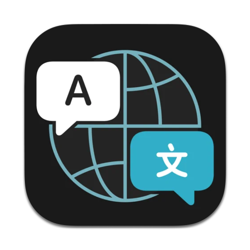

# AI Translator / AI 翻译器

<p align="center">
  
</p>

<p align="center">
  <strong>A powerful macOS translation, polishing, and summarization tool powered by OpenAI-compatible APIs</strong><br>
  <strong>基于 OpenAI 兼容 API 的强大 macOS 翻译、润色和摘要工具</strong>
</p>

<p align="center">
  
  
  
  
  
</p>

---

[English](#english) | [中文](#中文)

---

## English

### 📋 Overview

AI Translator is a native macOS application that provides seamless translation, text polishing, and content summarization using OpenAI-compatible APIs. Built with SwiftUI, it offers a beautiful, accessible, and highly customizable interface with global hotkey support, multiple language detection engines, and proxy configuration.

### ✨ Features

#### Core Capabilities
- **🌐 Translation**: Automatically detect source language and translate to your target language
- **✍️ Text Polishing**: Improve clarity, conciseness, and coherence in any language
- **📝 Summarization**: Generate concise summaries of lengthy content
- **🔄 Real-time Streaming**: See results as they're generated with SSE (Server-Sent Events)

#### Language Support
- **🔍 Multiple Detection Engines**: 
  - Local algorithm (offline)
  - Google Translate API
  - Baidu Translate API
  - Bing Translator API
- **🌍 Auto Language Detection**: Automatically identifies source language
- **↔️ Smart Language Pairing**: Intelligent source-target language suggestions
- **🔄 Language Swap**: Quick swap between source and target languages

#### User Experience
- **⌨️ Global Hotkeys**: Control the app from anywhere on your Mac
  - Show/Hide window: default ⌘⇧W
  - Toggle mode: default ⌃⌥M (local when app is focused)
  - Quick copy output: default ⌃⌥C (local when app is focused)
- **📌 Always on Top**: Pin window to stay above other applications
- **🎨 Native macOS Design**: Beautiful UI following Apple's Human Interface Guidelines
- **♿ Accessibility**: Full VoiceOver support and keyboard navigation
- **🌐 Bilingual Interface**: English and Simplified Chinese

#### Advanced Features
- **🔐 Proxy Support**: HTTP and SOCKS5 proxy with authentication
- **⚙️ Customizable Shortcuts**: Configure send key (Enter or ⌘Enter)
 - **💾 Import/Export Settings & History**: Export/import preferences (JSON) and translation history (JSON)
 - **🕘 History Window**: Search, filter by mode, group by date, import/export, clear
 - **📊 Session State Management**: Maintains context across sessions
- **🚀 Optimized Performance**: Efficient resource usage with async/await

### 🛠 Requirements

- **macOS**: 13.0 (Ventura) or later
- **Xcode**: 15.0 or later
- **Swift**: 5.9 or later
- **OpenAI-compatible API**: OpenAI, Azure OpenAI, or any compatible service

### 📦 Installation

#### From Source

1. **Clone the repository**
   ```bash
   git clone https://github.com/AlliotTech/AITranslator.git
   cd AITranslator
   ```

2. **Open in Xcode**
   ```bash
   open AITranslator.xcodeproj
   ```

3. **Build and Run**
   - Select your target device
   - Press `⌘R` or click the Run button

Optional developer tooling via `just` and `asdf`:
- Install `asdf`, then run `just setup` to install tool versions defined in `.tool-versions`
- Run `just build`, `just run`, `just lint`, or `just clean` for common tasks

### ⚙️ Configuration

#### Initial Setup

1. **Launch the application**
2. **Open Settings** (⌘,)
3. **Configure API settings**:
   - Base URL: Your OpenAI-compatible endpoint
   - Model: e.g., `gpt-4o-mini`, `gpt-5-chat`
   - API Key: Your authentication key

#### Optional Settings

**General**
- App Language: System, English, or Simplified Chinese
- Detection Engine: Choose your preferred language detection method
- Default Target Language: Fallback language for translations

**Network Proxy**
- Type: None, HTTP, or SOCKS5
- Host/Port: Proxy server details
- Credentials: Username and password (optional)
- No Proxy Targets: Comma-separated bypass list

**Hotkeys**
- Show/Hide Window: Global hotkey (default: ⌘⇧W)
- Toggle Mode: Switch between Translate/Polish/Summarize (default: ⌃⌥M)
- Quick Copy: Copy output to clipboard (default: ⌃⌥C)
- Send Key: Choose Enter or ⌘Enter

### 🚀 Usage

#### Basic Workflow

1. **Enter text** in the left pane
2. **Select mode**:
   - 🌐 **Translate**: Convert text between languages
   - ✍️ **Polish**: Improve text quality in the same language
   - 📝 **Summarize**: Generate concise summaries
3. **Choose languages** (for Translate and Summarize modes)
4. **Press Send** (Enter or ⌘Enter based on your settings)
5. **View results** streaming in real-time in the right pane

#### Keyboard Shortcuts

| Action | Shortcut |
|--------|----------|
| Send / Stop | ⏎ or ⌘⏎ (configurable) |
| Swap Languages | ⇧⌘S (in-app) |
| Copy Output | ⌘S (in-app) |
| Toggle Mode | ⌃⌥M (default, configurable) |
| Show/Hide Window | ⌘⇧W (default, configurable) |
| Settings | ⌘, |

#### Tips

- **Paste Detection**: The app automatically detects language when you paste text
- **Mode Switching**: Quickly switch between modes with the toolbar picker
- **Pin Window**: Keep the translator always visible while working
- **Export Settings**: Save your configuration for backup or sharing

### 🏗 Architecture

```
AITranslator/
├── AITranslatorApp.swift          # App entry point
├── ContentView.swift              # Main UI container
├── Models/                        # Data models
│   ├── AppLanguage.swift         # UI language settings
│   ├── KeyboardShortcut.swift    # Hotkey definitions
│   ├── Preferences.swift         # User preferences
│   └── SessionState.swift        # Translation session state
├── ViewModels/                    # Business logic
│   └── AppViewModel.swift        # Main view model
├── Views/                         # UI components
│   ├── Main/                     # Main window views
│   │   ├── TopBar.swift
│   │   ├── LeftInputPane.swift
│   │   ├── RightOutputPane.swift
│   │   └── BottomBar.swift
│   └── Settings/                 # Settings views
│       └── Sections/
│           ├── GeneralSettingsSection.swift
│           ├── APISettingsSection.swift
│           ├── ProxySettingsSection.swift
│           └── HotkeysSettingsSection.swift
├── Services/                      # Core services
│   ├── OpenAI/                   # OpenAI client
│   │   ├── OpenAIClient.swift
│   │   └── SSEParser.swift
│   ├── Detection/                # Language detection
│   │   ├── LanguageDetector.swift
│   │   └── LanguageUtils.swift
│   ├── HistoryStore.swift        # History persistence (JSON in Application Support)
│   ├── Hotkeys/                  # Global hotkey management
│   │   └── HotkeyManager.swift
│   ├── Network/                  # HTTP client with proxy
│   │   └── HTTPClient.swift
│   ├── PreferencesStore.swift    # Settings persistence
│   └── Protocols.swift           # Protocol definitions
├── Utils/                         # Utility components
│   ├── Accessibility.swift       # VoiceOver support
│   ├── Localization.swift        # i18n utilities
│   ├── Debouncer.swift          # Input debouncing
│   └── ...                       # Other utilities
└── Styles/                        # UI styling
    ├── Buttons.swift
    └── Metrics.swift
```

### 🔧 Development Setup

#### Prerequisites

Install SwiftLint for code quality:
```bash
brew install swiftlint
```

#### Building

```bash
# Build for debugging
xcodebuild -project AITranslator.xcodeproj -scheme AITranslator -configuration Debug

# Build for release
xcodebuild -project AITranslator.xcodeproj -scheme AITranslator -configuration Release
```

#### Linting

```bash
# Run SwiftLint
swiftlint

# Auto-fix issues
swiftlint --fix

# Lint specific files
swiftlint lint --path AITranslator/
```

#### Code Standards

- **Swift Style**: Follow [Swift API Design Guidelines](https://swift.org/documentation/api-design-guidelines/)
- **Line Length**: 150 characters (warning), 200 (error)
- **End of File**: All files must end with a single newline
- **No Trailing Whitespace**: Clean up whitespace on save
- **Sorted Imports**: Keep imports alphabetically sorted
- **Accessibility**: All UI elements must have proper labels

### 🧪 Testing

Currently no unit test targets are included. If you add tests, you can run them via:
`xcodebuild test -project AITranslator.xcodeproj -scheme AITranslator`

### 🤝 Contributing

Contributions are welcome! Please follow these guidelines:

1. **Fork the repository**
2. **Create a feature branch** (`git checkout -b feature/amazing-feature`)
3. **Make your changes**
   - Follow code style guidelines
   - Add tests if applicable
   - Run SwiftLint before committing
4. **Commit your changes** (`git commit -m 'Add amazing feature'`)
5. **Push to the branch** (`git push origin feature/amazing-feature`)
6. **Open a Pull Request**

### 📝 License

This project is licensed under the MIT License - see the LICENSE file for details.

### 🙏 Acknowledgments

- OpenAI for the API
- Apple for SwiftUI and excellent development tools
- All contributors and users

### 📧 Contact

For questions or support, please open an issue on GitHub.

---

## 中文

### 📋 项目概述

AI Translator 是一款原生 macOS 应用程序，使用 OpenAI 兼容 API 提供无缝的翻译、文本润色和内容摘要功能。采用 SwiftUI 构建，提供美观、可访问且高度可定制的界面，支持全局快捷键、多种语言检测引擎和代理配置。

### ✨ 功能特性

#### 核心功能
- **🌐 翻译**：自动检测源语言并翻译到目标语言
- **✍️ 文本润色**：提升任何语言的文本清晰度、简洁性和连贯性
- **📝 内容摘要**：为冗长内容生成简洁摘要
- **🔄 实时流式传输**：通过 SSE（服务器发送事件）实时查看生成结果

#### 语言支持
- **🔍 多种检测引擎**：
  - 本地算法（离线）
  - Google 翻译 API
  - 百度翻译 API
  - 必应翻译 API
- **🌍 自动语言检测**：自动识别源语言
- **↔️ 智能语言配对**：智能的源语言-目标语言建议
- **🔄 语言互换**：快速交换源语言和目标语言

#### 用户体验
- **⌨️ 全局快捷键**：在 Mac 上的任何位置控制应用
  - 显示/隐藏窗口：默认 ⌘⇧W
  - 切换模式：默认 ⌃⌥M（应用在前台时生效）
  - 快速复制输出：默认 ⌃⌥C（应用在前台时生效）
- **📌 窗口置顶**：固定窗口保持在其他应用程序之上
- **🎨 原生 macOS 设计**：遵循 Apple 人机界面指南的精美 UI
- **♿ 无障碍访问**：完整的 VoiceOver 支持和键盘导航
- **🌐 双语界面**：英语和简体中文

#### 高级特性
- **🔐 代理支持**：支持 HTTP 和 SOCKS5 代理及身份验证
- **⚙️ 可自定义快捷键**：配置发送键（回车或 ⌘回车）
 - **💾 导入/导出（设置与历史）**：导出/导入偏好设置（JSON）与翻译历史（JSON）
 - **🕘 历史记录窗口**：搜索、按模式筛选、按日期分组、导入/导出、清空
 - **📊 会话状态管理**：在会话间保持上下文
- **🚀 性能优化**：使用 async/await 的高效资源利用

### 🛠 系统要求

- **macOS**: 13.0 (Ventura) 或更高版本
- **Xcode**: 15.0 或更高版本
- **Swift**: 5.9 或更高版本
- **OpenAI 兼容 API**: OpenAI、Azure OpenAI 或任何兼容服务

### 📦 安装

#### 从源代码构建

1. **克隆仓库**
   ```bash
   git clone https://github.com/yourusername/AITranslator.git
   cd AITranslator
   ```

2. **在 Xcode 中打开**
   ```bash
   open AITranslator.xcodeproj
   ```

3. **构建并运行**
   - 选择目标设备
   - 按 `⌘R` 或点击运行按钮

可选开发工具（`just` + `asdf`）：
- 安装 `asdf` 后运行 `just setup`，根据 `.tool-versions` 安装工具版本
- 使用 `just build`、`just run`、`just lint`、`just clean` 执行常用任务

### ⚙️ 配置

#### 初始设置

1. **启动应用程序**
2. **打开设置** (⌘,)
3. **配置 API 设置**：
   - 接口地址：您的 OpenAI 兼容端点
   - 模型：例如 `gpt-4o-mini`、`gpt-5-chat`
   - API 密钥：您的身份验证密钥

#### 可选设置

**通用**
- 软件语言：系统、英语或简体中文
- 检测引擎：选择您偏好的语言检测方法
- 默认目标语言：翻译的后备语言

**网络代理**
- 类型：不使用、HTTP 或 SOCKS5
- 主机/端口：代理服务器详情
- 凭据：用户名和密码（可选）
- 代理排除目标：逗号分隔的绕过列表

**快捷键**
- 显示/隐藏窗口：全局快捷键（默认：⌘⇧W）
- 切换模式：在翻译/润色/总结之间切换（默认：⌃⌥M）
- 快速复制：复制输出到剪贴板（默认：⌃⌥C）
- 发送键：选择回车或 ⌘回车

### 🚀 使用方法

#### 基本工作流程

1. **在左侧面板输入文本**
2. **选择模式**：
   - 🌐 **翻译**：在语言间转换文本
   - ✍️ **润色**：改善同一语言的文本质量
   - 📝 **摘要**：生成简洁摘要
3. **选择语言**（翻译和摘要模式）
4. **按发送**（根据设置为回车或 ⌘回车）
5. **在右侧面板实时查看结果流式传输**

#### 键盘快捷键

| 操作 | 快捷键 |
|------|--------|
| 发送/停止 | ⏎ 或 ⌘⏎（可配置）|
| 交换语言 | ⇧⌘S（应用内）|
| 复制输出 | ⌘S（应用内）|
| 切换模式 | ⌃⌥M（默认，可配置）|
| 显示/隐藏窗口 | ⌘⇧W（默认，可配置）|
| 设置 | ⌘, |

#### 使用技巧

- **粘贴检测**：粘贴文本时应用会自动检测语言
- **模式切换**：使用工具栏选择器快速切换模式
- **固定窗口**：工作时保持翻译器始终可见
- **导出设置**：保存配置以备份或共享

### 🏗 架构

```
AITranslator/
├── AITranslatorApp.swift          # 应用入口点
├── ContentView.swift              # 主 UI 容器
├── Models/                        # 数据模型
│   ├── AppLanguage.swift         # UI 语言设置
│   ├── KeyboardShortcut.swift    # 快捷键定义
│   ├── Preferences.swift         # 用户偏好设置
│   └── SessionState.swift        # 翻译会话状态
├── ViewModels/                    # 业务逻辑
│   └── AppViewModel.swift        # 主视图模型
├── Views/                         # UI 组件
│   ├── Main/                     # 主窗口视图
│   │   ├── TopBar.swift
│   │   ├── LeftInputPane.swift
│   │   ├── RightOutputPane.swift
│   │   └── BottomBar.swift
│   └── Settings/                 # 设置视图
│       └── Sections/
│           ├── GeneralSettingsSection.swift
│           ├── APISettingsSection.swift
│           ├── ProxySettingsSection.swift
│           └── HotkeysSettingsSection.swift
├── Services/                      # 核心服务
│   ├── OpenAI/                   # OpenAI 客户端
│   │   ├── OpenAIClient.swift
│   │   └── SSEParser.swift
│   ├── Detection/                # 语言检测
│   │   ├── LanguageDetector.swift
│   │   └── LanguageUtils.swift
│   ├── HistoryStore.swift        # 历史记录持久化（应用支持目录中的 JSON）
│   ├── Hotkeys/                  # 全局快捷键管理
│   │   └── HotkeyManager.swift
│   ├── Network/                  # 带代理的 HTTP 客户端
│   │   └── HTTPClient.swift
│   ├── PreferencesStore.swift    # 设置持久化
│   └── Protocols.swift           # 协议定义
├── Utils/                         # 实用工具组件
│   ├── Accessibility.swift       # VoiceOver 支持
│   ├── Localization.swift        # 国际化工具
│   ├── Debouncer.swift          # 输入防抖
│   └── ...                       # 其他工具
└── Styles/                        # UI 样式
    ├── Buttons.swift
    └── Metrics.swift
```

### 🔧 开发设置

#### 前置要求

安装 SwiftLint 以确保代码质量：
```bash
brew install swiftlint
```

#### 构建

```bash
# 调试构建
xcodebuild -project AITranslator.xcodeproj -scheme AITranslator -configuration Debug

# 发布构建
xcodebuild -project AITranslator.xcodeproj -scheme AITranslator -configuration Release
```

#### 代码检查

```bash
# 运行 SwiftLint
swiftlint

# 自动修复问题
swiftlint --fix

# 检查特定文件
swiftlint lint --path AITranslator/
```

#### 代码规范

- **Swift 风格**：遵循 [Swift API 设计指南](https://swift.org/documentation/api-design-guidelines/)
- **行长度**：150 字符（警告），200（错误）
- **文件结尾**：所有文件必须以单个换行符结束
- **无尾随空格**：保存时清理空格
- **导入排序**：保持导入按字母顺序排列
- **无障碍访问**：所有 UI 元素必须有适当的标签

### 🧪 测试

当前工程未包含单元测试目标。如需添加测试，可使用：
`xcodebuild test -project AITranslator.xcodeproj -scheme AITranslator`

### 🤝 贡献

欢迎贡献！请遵循以下指南：

1. **Fork 仓库**
2. **创建功能分支** (`git checkout -b feature/amazing-feature`)
3. **进行更改**
   - 遵循代码风格指南
   - 如适用，添加测试
   - 提交前运行 SwiftLint
4. **提交更改** (`git commit -m 'Add amazing feature'`)
5. **推送到分支** (`git push origin feature/amazing-feature`)
6. **打开 Pull Request**

### 📝 许可证

本项目采用 MIT 许可证 - 详见 LICENSE 文件。

### 🙏 致谢

- OpenAI 提供的 API
- Apple 提供的 SwiftUI 和优秀的开发工具
- 所有贡献者和用户

### 📧 联系方式

如有问题或需要支持，请在 GitHub 上提出 issue。

---

<p align="center">Made with ❤️ for the macOS community</p>
